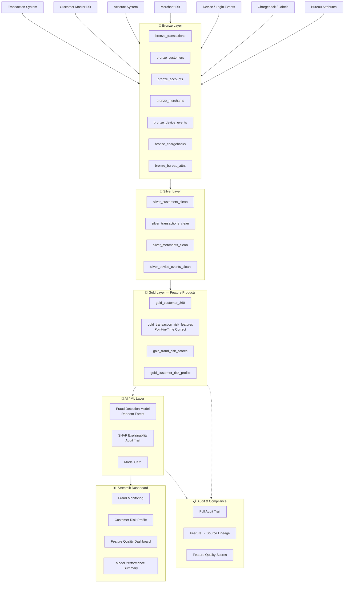

# Finance POC
## Point-in-Time Feature Quality Strategy for Fraud Detection & Risk Scoring

---

## Business Problem

A financial services company processes millions of transactions daily and needs to:

1. **Detect fraudulent transactions** in near real-time
2. **Score customer risk** for credit and behavioral risk management
3. **Provide auditable explanations** for every risk decision (regulatory requirement)

**The core data engineering problem**: Financial AI is uniquely vulnerable to a data quality failure called **data leakage** — where information from the future (relative to the event being predicted) contaminates training features. Without point-in-time correctness enforced at the data layer, every fraud model is at risk.

### The Data Leakage Failure Pattern

```
Training time: "Is transaction T fraudulent?"
Feature computed: "customer_avg_tx_30d = $234"
← But this average includes transactions AFTER T that weren't available when T occurred!

Result: Model learns patterns that can never exist at inference time.
        It achieves 94% AUC in backtesting and 71% AUC in production.
```

This is not a model problem. It is a **data architecture problem**. The pipeline did not enforce point-in-time correctness when building features.

**This POC proves that fraud detection AI is only as good as the temporal integrity of its feature data.**

---

## Why AI Fails Without Upstream Data Strategy

```mermaid
flowchart TD
    subgraph Without["❌ Without Point-in-Time Correctness"]
        W1[Transaction at T=10:00am]
        W2[Feature: avg_tx_7d computed at T=Now\nIncludes transactions after 10:00am]
        W3[Training: model learns 'current' patterns]
        W4[Inference: only 10:00am data available]
        W5[Training-Serving Skew: AUC drops 23%\nFraud missed. Losses increase.]
        W1 --> W2 --> W3 --> W4 --> W5
    end

    subgraph With["✅ With Point-in-Time Correctness"]
        M1[Transaction at T=10:00am]
        M2[Feature: avg_tx_7d computed as-of 10:00am\nOnly data before T used]
        M3[Training: model learns real-time patterns]
        M4[Inference: same logic, same data window]
        M5[No training-serving skew. Model works in prod.]
        M1 --> M2 --> M3 --> M4 --> M5
    end
```



---

## Data Strategy: Governed Feature Quality and Auditability

### Core Approach

1. **Point-in-time feature computation**: All features use only data available at or before the transaction timestamp
2. **Feature quality scoring**: Every feature has a freshness score and completeness score
3. **Full lineage**: Every model score traces back to the source transaction
4. **Auditability**: Regulators can reconstruct any model decision from source data
5. **Model cards**: Every model version documents training data, features, and limitations

---

## Architecture Diagram



---

## Data Model Overview

| Entity | Table | Records (Synthetic) |
|--------|-------|---------------------|
| Customers | `silver_customers_clean` | 5,000 |
| Accounts | `bronze_accounts` | 6,000 |
| Transactions | `silver_transactions_clean` | 100,000 |
| Merchants | `silver_merchants_clean` | 2,000 |
| Fraud Labels | `bronze_chargebacks` | 3,500 |
| Device Events | `silver_device_events_clean` | 80,000 |
| Bureau Attributes | `bronze_bureau_attrs` | 5,000 |

---

## Pipeline Steps

1. **Generate Synthetic Data** — All CSV source files with realistic fraud patterns
2. **Bronze Ingestion** — Load into DuckDB with metadata
3. **Silver Standardization** — Clean customers, transactions, merchants, device events
4. **Gold Feature Engineering** — Point-in-time correct features (critical step)
5. **Data Quality Checks** — Freshness, completeness, feature validity
6. **Model Training** — Fraud classification with point-in-time enforced features
7. **Model Evaluation** — AUC, precision, recall with auditability report
8. **Dashboard** — Real-time fraud and risk monitoring

---

## Point-in-Time Feature Correctness

### The Problem This Solves

For every transaction being scored, features must reflect the world **as it existed at the moment of the transaction**, not as it exists when we run the analysis.

### Correct vs Incorrect Feature Computation

```sql
-- WRONG: Uses all data up to NOW (data leakage)
SELECT customer_id, AVG(amount) as avg_tx_30d
FROM transactions
WHERE transaction_date >= NOW() - 30 days
GROUP BY customer_id;

-- CORRECT: Point-in-time — only data before transaction T
SELECT t.transaction_id, t.customer_id,
       AVG(h.amount) as avg_tx_30d_pit
FROM transactions t
JOIN transactions h
  ON h.customer_id = t.customer_id
  AND h.transaction_date BETWEEN t.transaction_date - INTERVAL '30 days'
                              AND t.transaction_date  -- NOT today!
  AND h.transaction_id != t.transaction_id
GROUP BY t.transaction_id, t.customer_id;
```

This distinction is implemented in `gold_transaction_risk_features`.

---

## Governance Considerations

- All customer and transaction data is 100% synthetic
- No real PII, account numbers, or financial data is used
- Fraud labels are synthetic with realistic prevalence (~3%)
- Model card documents all assumptions and limitations
- Audit trail links every score to source transaction records

---

## How to Run Locally

```bash
cd Finance
python src/generate_synthetic_data.py
python src/run_pipeline.py
python src/data_quality_checks.py
python src/train_model.py
python src/evaluate_model.py
streamlit run app/streamlit_app.py
```

---

## Expected Outputs

- `data/gold/*.parquet` — Gold feature tables
- `finance.duckdb` — Analytical database
- `models/fraud_detection_model.joblib` — Trained fraud model
- `outputs/quality_report.json` — Feature quality scorecard
- `outputs/model_evaluation.json` — AUC, precision, recall, auditability
- `outputs/audit_trail_sample.json` — Sample score lineage

---

## Future Improvements

- Add real-time streaming simulation (Kafka → DuckDB)
- Add feature store with time-travel query support
- Implement Evidently for feature drift monitoring
- Add model monitoring dashboard with AUC degradation alerts
- Implement LIME for per-transaction explanations
