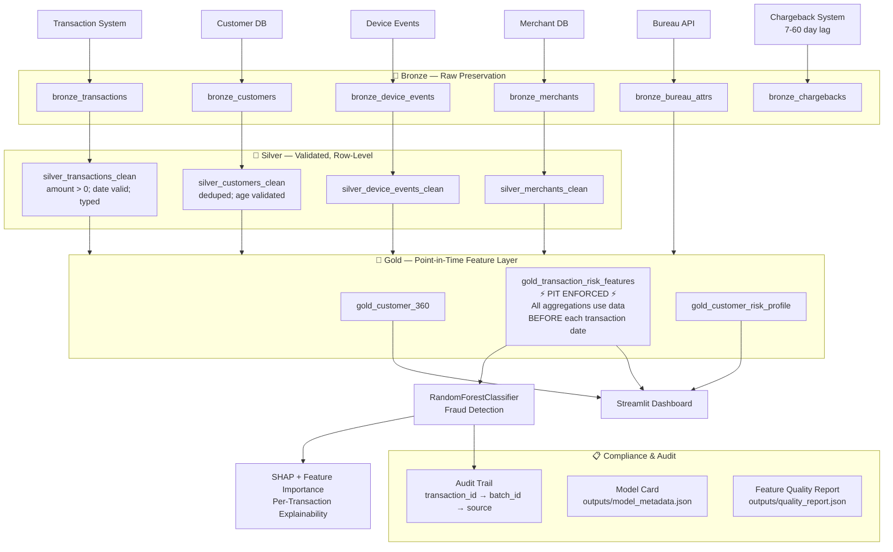

# Finance Data Architecture

## Architecture Philosophy

The Finance POC implements a **Feature-Quality Extended Medallion Architecture**. The critical extension beyond the standard medallion pattern is the enforcement of **point-in-time correctness** in the Gold feature layer.

Standard medallion architectures compute aggregations over current data. This is correct for reporting use cases but catastrophically wrong for AI use cases where the model predicts past events (fraud detection, risk scoring, chargeback prediction). The architecture introduces the **PIT Feature Layer** as a first-class architectural component.

---

## Layer-by-Layer Architecture

### Bronze Layer

Raw transaction data ingested exactly as received. Every record carries `_batch_id`, `_load_ts`, and `_source_file` for full lineage.

**Key challenge**: Transaction volume (100K+/day in production) means Bronze must be partitioned by date and loaded incrementally.

### Silver Layer

Standardization, validation, and type casting. No aggregations here — Silver is row-level and clean.

**Key data quality rules enforced**:
- Amount > 0 (negative amounts indicate refunds, handled separately)
- Transaction date ≤ today (no future-dated transactions)
- Customer ID must link to known customers (≥98% linkage)
- All amounts rounded to 2 decimal places

### Gold Layer — Point-in-Time Feature Product

This is the critical layer for AI. The `gold_transaction_risk_features` table implements the **temporal self-join pattern** to compute all historical aggregations as-of each transaction's timestamp.

**Architectural principle**: *Features must be computed as if you are standing at the moment the transaction occurred, looking backwards — never forwards.*

This is enforced via:
```sql
AND h.transaction_date BETWEEN t.transaction_date - INTERVAL '30 days'
                            AND t.transaction_date  -- upper bound = event time, not now
AND h.transaction_id != t.transaction_id           -- no self-reference
```

**Gold tables**:
- `gold_customer_360` — Customer profile with bureau attributes
- `gold_transaction_risk_features` — PIT-correct feature set (one row per transaction)
- `gold_customer_risk_profile` — Customer-level aggregated risk
- `gold_fraud_risk_scores` — Final scored output with audit metadata

### AI / ML Layer

Random Forest classifier trained on `gold_transaction_risk_features`. The label (`is_fraud`) is present in Gold for training purposes; at inference time, only feature columns are used.

**Key design decision**: Using a tree-based model (Random Forest) because:
1. Feature importance is built-in and interpretable
2. No assumption of linearity — fraud patterns are non-linear
3. Robust to outliers (fraudulent amounts can be extreme)
4. Class-weighted training handles the 3% fraud prevalence

### Audit Layer

Implemented via `outputs/audit_trail_sample.json`:
- Every prediction links to `transaction_id`
- Every `transaction_id` links to `_batch_id`
- Top feature drivers documented per prediction
- Model version and training data documented in model card

---

## Mermaid Architecture Diagram


