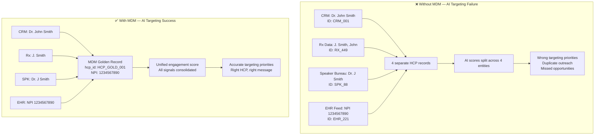
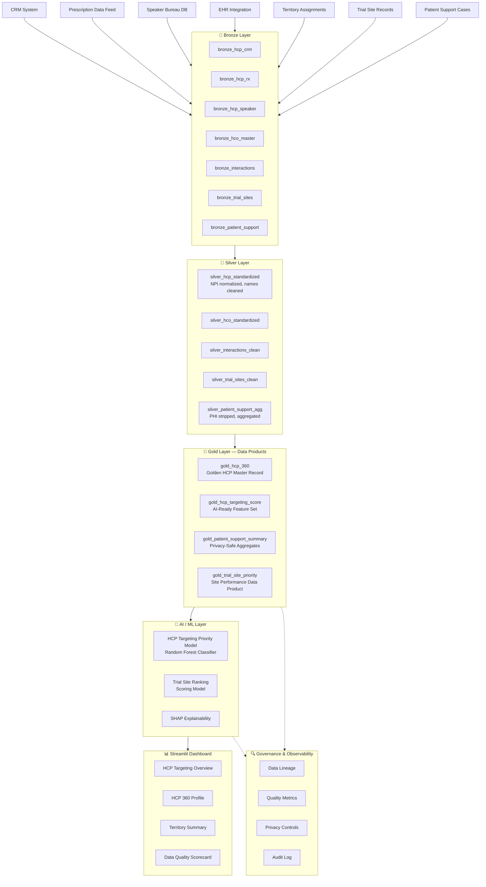

# Healthcare / Pharma POC
## MDM-First Governed Data Product Strategy for HCP AI Targeting

---

## Business Problem

A pharmaceutical company operates across thousands of Healthcare Professionals (HCPs) and Healthcare Organizations (HCOs). Their commercial teams need to:

1. **Target the right HCPs** with the right message at the right time
2. **Prioritize clinical trial sites** for investigator-initiated trials
3. **Monitor patient support program efficacy** at the aggregate level (without PHI)

**The problem**: HCP data lives in CRM, EHR integration feeds, conference registrations, prescription data, and speaker bureau systems — all using different identifiers. The same physician appears as:
- `Dr. John Smith, MD` in CRM
- `J. Smith, John` in the speaker bureau
- `Smith, J.` in prescription data
- `NPI:1234567890` in the EHR feed

Without a **Master Data Management (MDM)** strategy, the AI targeting system:
- Treats 1 physician as 4 separate records
- Splits engagement scores across 4 entities
- Recommends 4 calls to the same physician (under-serving others)
- Cannot aggregate patient support outcomes correctly

**This POC proves that HCP AI targeting is only as good as the HCP master data that feeds it.**

---

## Why AI Fails Without Upstream Data Strategy



---

## Data Strategy: MDM-First Governed Data Product

### Core Approach

1. **Source disambiguation**: Assign every source system a unique namespace
2. **Entity resolution**: Link cross-source records to a single golden HCP/HCO ID
3. **Master record governance**: Define ownership and stewardship of the golden record
4. **Privacy-preserving aggregation**: Aggregate patient data before making it available for AI consumption
5. **Governed data products**: Publish curated Gold layer tables as certified data products

### Data Ownership Model

| Dataset | Owner | Steward | Refresh |
|---------|-------|---------|---------|
| HCP Master | MDM Team | Data Governance | Weekly |
| HCO Master | MDM Team | Data Governance | Weekly |
| Interaction / Call Activity | Commercial Ops | CRM Admin | Daily |
| Prescription Aggregates | Market Data Team | Analytics | Monthly |
| Patient Support Summary | Patient Services | Privacy Officer | Monthly (de-identified only) |
| Trial Site Performance | Medical Affairs | Clinical Ops | Quarterly |

---

## Architecture Diagram



---

## Data Model Overview

### Key Entities

| Entity | Table | Records (Synthetic) | Description |
|--------|-------|--------------------|-|
| HCP Master | `gold_hcp_360` | 2,000 | Golden healthcare provider records |
| HCO Master | `silver_hco_standardized` | 500 | Healthcare organizations |
| HCP-HCO Affiliations | `silver_hcp_hco_affiliations` | 3,500 | Provider-organization links |
| Interactions | `silver_interactions_clean` | 15,000 | Call/engagement activity |
| Prescription Aggregates | `silver_rx_aggregates` | 8,000 | Product-level prescription data |
| Patient Support Cases | `gold_patient_support_summary` | 1,200 | De-identified case aggregates |
| Trial Sites | `gold_trial_site_priority` | 200 | Clinical trial site data |

---

## Pipeline Steps

1. **Generate Synthetic Data** (`src/generate_synthetic_data.py`)
   - Creates all CSV source files in `data/raw/`

2. **Bronze Ingestion** (`src/run_pipeline.py` → bronze phase)
   - Loads CSVs into DuckDB Bronze layer tables
   - Adds ingestion metadata (batch_id, load_ts, source)

3. **Silver Standardization** (dbt models in `dbt/models/silver/`)
   - Normalizes HCP names and identifiers
   - Deduplicates across source systems
   - Validates NPI format and completeness
   - Strips PHI from patient support data

4. **MDM Golden Record Creation** (dbt models in `dbt/models/gold/`)
   - Creates unified `gold_hcp_360` from resolved cross-source records
   - Computes KPIs: engagement score, specialty tier, territory coverage
   - Builds trial site performance data product

5. **Data Quality Checks** (`src/data_quality_checks.py`)
   - Validates completeness, uniqueness, validity across all layers
   - Generates quality scorecard

6. **Model Training** (`src/train_model.py`)
   - Trains HCP targeting priority model on Gold features
   - Generates SHAP explanations

7. **Dashboard** (`app/streamlit_app.py`)
   - Interactive HCP targeting and quality monitoring

---

## Data Quality Checks

| Check | Layer | Rule |
|-------|-------|------|
| NPI completeness | Silver | NPI must be present for all HCPs (≥95%) |
| NPI format | Silver | Must match 10-digit numeric pattern |
| Specialty code validity | Silver | Must be in approved specialty code list |
| HCP uniqueness | Gold | No duplicate hcp_id in gold_hcp_360 |
| Engagement score range | Gold | Must be in [0, 100] |
| Target score validity | Gold | Must be one of: A, B, C, D |
| Interaction date validity | Silver | interaction_date must be ≤ today |
| Territory coverage | Gold | All HCPs must have exactly one territory |

---

## Governance Considerations

- **No real PHI**: All patient data is de-identified synthetic aggregates
- **NPI-based identity**: NPI is the authoritative HCP identifier in the US
- **Interaction data masking**: Rep names are anonymized in this POC
- **Specialty tier classification**: Follows standard commercial segmentation (no actual commercial strategy)
- **Lineage tracked**: Every Gold field traces to Silver source and Bronze raw data

---

## AI / ML Use Case

**Model**: Random Forest Classifier for HCP targeting priority (A/B/C/D tier)

**Target Variable**: `targeting_priority` (derived from prescription volume, engagement, and specialty)

**Key Features**:
- Prescription volume (adjusted)
- Interaction frequency (90-day rolling)
- Days since last interaction
- HCP specialty tier
- Territory reach score
- Patient support case volume (territory-level aggregate)

**Explainability**: SHAP values computed for every prediction — each HCP score can be explained in terms of top 3 contributing factors.

---

## How to Run Locally

```bash
# From repository root
cd Healthcare

# Generate all synthetic data
python src/generate_synthetic_data.py

# Run full pipeline
python src/run_pipeline.py

# Run quality checks
python src/data_quality_checks.py

# Train model
python src/train_model.py

# Evaluate model
python src/evaluate_model.py

# Launch dashboard
streamlit run app/streamlit_app.py
```

---

## Expected Outputs

- `data/raw/*.csv` — Synthetic source data files
- `data/gold/*.parquet` — Gold layer data products
- `healthcare.duckdb` — DuckDB analytical database
- `models/hcp_targeting_model.joblib` — Trained ML model
- `outputs/quality_report.json` — Data quality scorecard
- `outputs/model_evaluation.json` — Model performance metrics
- Streamlit dashboard at http://localhost:8501

---

## Future Improvements

- Add real NPI database lookup for validation
- Implement actual MDM deduplication with Levenshtein distance
- Add SCD Type 2 history tracking for HCP changes
- Integrate with MLflow for model experiment tracking
- Add Evidently for feature drift monitoring
- Build API endpoint for real-time HCP scoring
