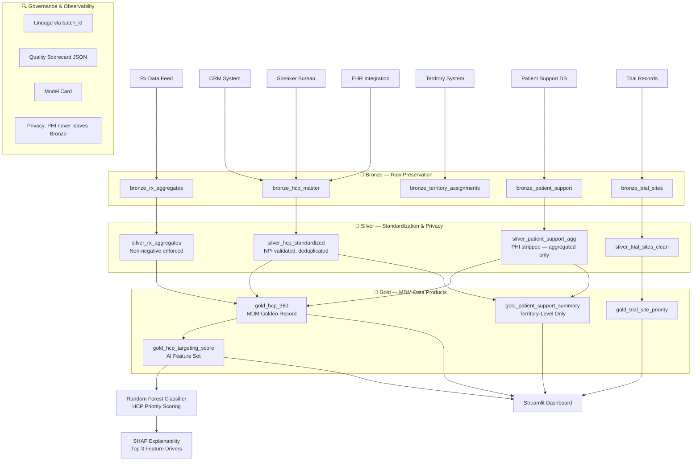

# Healthcare Data Architecture

## Architecture Philosophy

The Healthcare POC implements an **MDM-Extended Medallion Architecture**. While the standard medallion pattern (Bronze → Silver → Gold) provides the structural foundation, this implementation adds a critical MDM (Master Data Management) layer within the Gold tier to resolve the multi-source HCP identity problem.

### Why MDM Before AI?

Healthcare commercial AI systems depend on a **single, trusted view** of each healthcare provider. Without it:
- The same physician receives duplicate targeting recommendations
- Engagement scores are split across multiple records
- Prescription data cannot be attributed correctly to an HCP

The architecture enforces: **Resolve identity first. Compute signals second. Score for AI third.**

---

## Layer-by-Layer Architecture

### Bronze Layer — Raw Preservation

**Purpose**: Ingest source data exactly as received. Zero transformation. Maximum fidelity.

**Tables**:
- `bronze_hcp_master` — CRM HCP profiles
- `bronze_hco_master` — Hospital/clinic records
- `bronze_hcp_hco_affiliations` — Provider-organization links
- `bronze_hcp_interactions` — Sales rep call activity
- `bronze_rx_aggregates` — Prescription data (aggregate, not patient-level)
- `bronze_patient_support` — Patient support case records (pre-aggregation)
- `bronze_trial_sites` — Clinical trial site records

**Metadata added at Bronze**:
- `_batch_id`: Unique ID per ingestion batch
- `_load_ts`: Ingestion timestamp
- `_source_file`: Source file name
- `_source_system`: Originating system namespace

**Why it matters for AI**: The Bronze layer is the **audit anchor**. Any AI model prediction can be traced back to a specific Bronze record by following batch IDs.

---

### Silver Layer — Standardization & Entity Linkage

**Purpose**: Apply business rules, clean data, validate quality, strip PHI from patient data.

**Key Transformations**:
1. **Name normalization**: UPPER, TRIM applied to all name fields
2. **NPI validation**: 10-digit format check, stored as `dq_npi_valid` flag
3. **Deduplication**: QUALIFY ROW_NUMBER() enforces one record per hcp_id
4. **Date validation**: Interaction dates must be ≤ today
5. **Privacy aggregation**: Patient support cases aggregated to HCP+product+month level — individual case records never leave Bronze

**Tables**:
- `silver_hcp_standardized` — Cleansed HCP master
- `silver_hco_standardized` — Cleansed HCO master
- `silver_hcp_hco_affiliations` — Validated affiliation links
- `silver_interactions_clean` — Validated interaction records
- `silver_rx_aggregates` — Validated Rx aggregates
- `silver_patient_support_agg` — Privacy-safe PSP aggregates
- `silver_trial_sites_clean` — Validated trial site records

---

### Gold Layer — MDM Golden Records & Data Products

**Purpose**: Create the certified, business-ready, AI-consumable data products.

**MDM Golden Record Creation**:
The `gold_hcp_360` is the output of the MDM process — it merges signals from all Silver tables into a single, deduplicated, enriched HCP record. This is the "single source of truth" for any downstream AI system.

**Tables**:
- `gold_hcp_360` — Unified golden HCP record
- `gold_hcp_targeting_score` — AI-ready feature set with targeting priority label
- `gold_patient_support_summary` — Territory-level PSP aggregates
- `gold_trial_site_priority` — Site quality scored data product

---

### Semantic / Feature Layer

**Implemented as**: `gold_hcp_targeting_score` within the Gold layer

**Features Computed**:
- `engagement_score`: Composite signal (0–100)
- `days_since_last_interaction`: Recency signal
- `specialty_tier_num`: Ordinal encoding of specialty tier
- `market_share_pct`: Prescription market share
- `is_kol_flag`, `is_investigator_flag`: Binary entity attributes
- `targeting_priority`: Rule-based label for supervised ML training

**No data leakage**: All features use only data available as of the feature computation timestamp.

---

### AI / ML Layer

**Model**: Random Forest Classifier (scikit-learn)

**Task**: Predict HCP targeting priority tier (A/B/C/D)

**Explainability**:
- Feature importance from Random Forest (built-in)
- SHAP values for per-HCP explanation
- Every prediction includes top-3 feature drivers

**Model Card**:
- Intended use: Commercial field targeting optimization (synthetic POC only)
- Training data: `gold_hcp_targeting_score`
- Evaluation: 5-fold cross-validation, macro F1
- Known limitations: Trained on synthetic data; Rx signal 45-day lagged

---

### Dashboard / Reporting Layer

**Technology**: Streamlit

**Views**:
1. HCP Targeting Overview — Priority distribution, engagement scatter
2. HCP 360 Profile — Individual HCP signal drill-down
3. Territory Summary — Territory-level KPI comparison
4. Trial Site Prioritization — Site quality ranking
5. Data Quality Scorecard — Layer-by-layer quality metrics

---

### Governance and Observability Layer

**Components**:
- **Lineage**: `_batch_id` and `_load_ts` on all tables; documented in `docs/lineage.md`
- **Quality checks**: `src/data_quality_checks.py` produces `outputs/quality_report.json`
- **Model card**: Stored in `outputs/model_metadata.json`
- **Privacy controls**: PHI aggregation enforced at Silver layer; documented in `docs/governance.md`

---

## Mermaid Architecture Diagram

