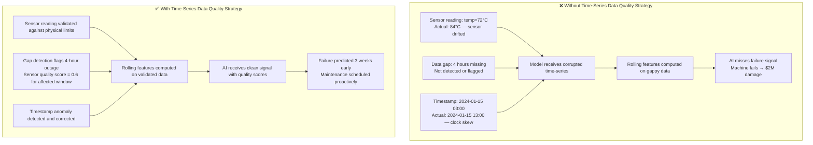
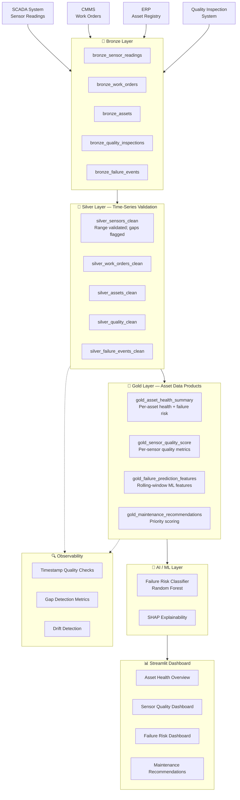

# Manufacturing POC
## Time-Series Data Quality Strategy for Predictive Maintenance AI

---

## Business Problem

A manufacturing company operates hundreds of pieces of critical equipment across multiple production lines. They need to:

1. **Predict equipment failures** before they occur (avoiding unplanned downtime)
2. **Prioritize maintenance work orders** based on actual asset health
3. **Monitor quality inspection results** in correlation with equipment condition

**The failure mode without data strategy**: Predictive maintenance AI is trained on sensor data. If that sensor data has gaps, drifts, incorrect timestamps, or invalid readings, the AI model learns to predict noise instead of actual failure patterns.

**Real consequence**: A sensor on a critical CNC machine develops a systematic -12°C drift over 6 months. The temperature readings stay within the "normal" range but are consistently underestimated. The predictive maintenance model misses the failure signal. A catastrophic bearing failure costs $2M in damage and 3 weeks of downtime.

**This POC proves that predictive maintenance AI is only as good as the time-series data quality that feeds it.**

---

## Why AI Fails Without Upstream Data Strategy



---

## Data Strategy: Time-Series Quality and Asset Data Product

### Core Approach

1. **Asset hierarchy data product**: Every sensor reading is contextualized by asset type, age, and criticality
2. **Timestamp quality enforcement**: Clock skew, duplicate timestamps, and ordering violations are detected and flagged
3. **Sensor range validation**: Physical bounds are defined per sensor type and violated readings are flagged
4. **Gap detection and imputation**: Missing sensor readings are detected, counted, and handled explicitly
5. **Rolling window feature engineering**: Features computed over validated, gap-aware time windows
6. **Sensor quality scoring**: Each sensor has a quality score that gates its use in ML features

---

## Architecture Diagram



---

## Data Model Overview

| Entity | Table | Records (Synthetic) |
|--------|-------|---------------------|
| Assets / Equipment | `silver_assets_clean` | 200 |
| Sensor Readings | `silver_sensors_clean` | 500,000 |
| Work Orders | `silver_work_orders_clean` | 2,000 |
| Failure Events | `silver_failure_events_clean` | 300 |
| Quality Inspections | `silver_quality_clean` | 5,000 |

---

## Why Time-Series Data Quality Is Critical for Predictive Maintenance AI

### 1. Timestamp Quality
Sensor readings arrive from SCADA systems that may have clock drift, network delays, or batch processing delays. A timestamp error of ±4 hours can make a failure signal appear before or after the actual event, corrupting the model's understanding of failure progression.

### 2. Sensor Range Validation
Physical sensors have physical limits. A temperature sensor reporting -273°C is clearly invalid. But what about a temperature reading 15% below the expected range? That may indicate sensor drift — not an obvious violation, but a signal that the sensor is no longer reliable.

### 3. Gap Detection
When a sensor goes offline for 4 hours, the data pipeline may fill the gap with nulls, zeros, or carry-forward the last value. None of these is correct. The gap must be detected, documented, and the affected features must be flagged with reduced confidence.

### 4. Rolling Window Feature Integrity
A 24-hour rolling average computed over a window with a 4-hour gap is not the same as one computed over complete data. The imputed values change the mean, the variance, and the trend signal. Rolling features must be annotated with the data completeness of their input window.

---

## How to Run Locally

```bash
cd Manufacturing
python src/generate_synthetic_data.py
python src/run_pipeline.py
python src/data_quality_checks.py
python src/train_model.py
python src/evaluate_model.py
streamlit run app/streamlit_app.py
```

---

## Expected Outputs

- `data/gold/*.parquet` — Gold asset and sensor data products
- `manufacturing.duckdb` — Analytical database
- `models/failure_prediction_model.joblib` — Trained model
- `outputs/quality_report.json` — Sensor and timestamp quality report
- `outputs/model_evaluation.json` — Model performance metrics
- Streamlit dashboard at http://localhost:8503
