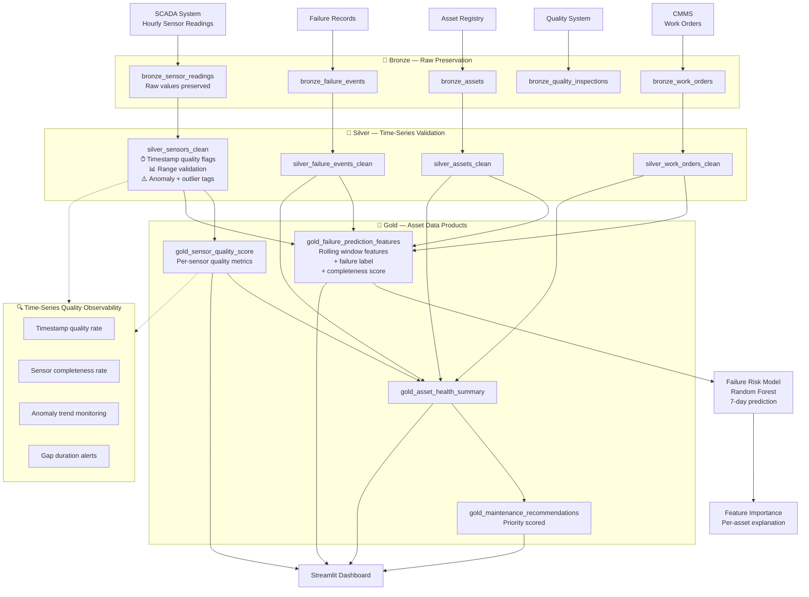

# Manufacturing Data Architecture

## Architecture Philosophy

The Manufacturing POC implements a **Time-Series Extended Medallion Architecture** with specialized handling for:
- SCADA timestamp quality and clock skew
- Sensor range validation with physical bounds
- Gap detection and completeness tracking
- Rolling window feature engineering with gap awareness
- Asset hierarchy data products

The critical architectural insight: **Sensor quality is model quality.** Every layer of the architecture is designed to track, measure, and propagate sensor data quality information so that the AI layer can reason about confidence, not just predictions.

---

## Layer-by-Layer Architecture

### Bronze Layer — Raw Time-Series Preservation

Raw sensor readings ingested exactly as received from SCADA. The Bronze layer must preserve:
- Original reading timestamps (even if they contain clock skew)
- Out-of-range readings (even if physically impossible)
- Duplicate readings (these will be deduplicated at Silver)
- Gaps in time (represented as missing rows, not filled)

**Why preserve bad data at Bronze?** Because the pattern of data quality problems is itself diagnostic. A sensor that produces 20% of readings with clock skew is a failing sensor — that information is lost if Bronze filters it out.

### Silver Layer — Time-Series Validation

The most complex layer for manufacturing data:

**Timestamp Validation**:
- `dq_timestamp_not_future`: reject readings timestamped >1 hour in the future
- `dq_timestamp_not_ancient`: reject readings older than the system start date
- Hour truncation for aggregation: `DATE_TRUNC('hour', reading_timestamp)`

**Sensor Range Validation**:
- Physical limits from asset master (expected_min, expected_max)
- Normal operating range (normal_low, normal_high)
- Four-category flagging: valid, anomaly, hard_outlier, future_timestamp

**Gap Tracking**:
- Gaps are represented as missing rows — they are NOT filled
- Gap duration is computed at the Gold layer when assessing completeness
- `sensor_completeness_pct` tracks what fraction of expected readings were received

### Gold Layer — Asset Data Products

**gold_sensor_quality_score**:
Per-sensor summary of quality metrics. This is the data quality product that gates AI consumption.

**gold_failure_prediction_features**:
Daily feature set per asset, including:
- Rolling sensor statistics (24h window, valid readings only)
- Asset attributes (age, criticality, maintenance interval)
- Maintenance recency (days since last work order completion)
- Failure proximity label (failure in next 7 days)
- Sensor completeness score for the feature window

**gold_asset_health_summary**:
Business-readable asset health overview combining sensor quality, failure history, and maintenance state.

**gold_maintenance_recommendations**:
Prioritized maintenance queue combining criticality, urgency, health score, and failure history.

### AI / ML Layer

Random Forest classifier predicting 7-day failure probability. Key design choices:
- `sensor_completeness_pct` is a model input — model learns to discount low-coverage windows
- `age_years` captures lifecycle effects
- `days_since_last_maintenance` captures cumulative wear
- Balanced class weights handle class imbalance (~3-10% failure days)

---

## Mermaid Architecture Diagram

