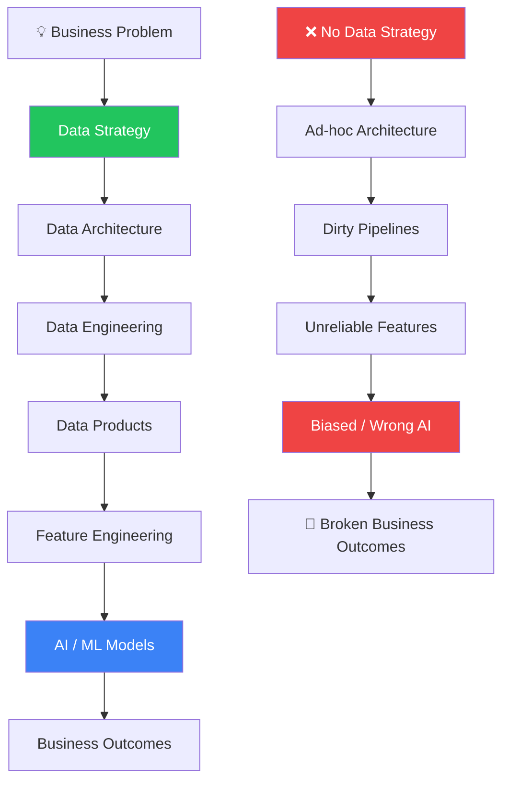
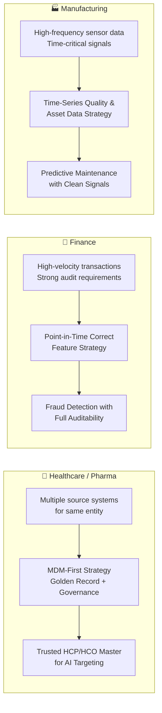
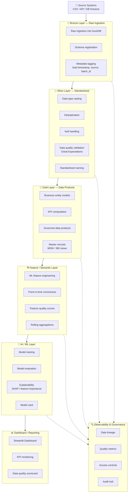

# AI-Ready Data Strategy POCs
## *Without Data Strategy, There Is No AI Strategy*

> **"The reliability of your AI system is not determined at the model layer — it is determined at the data layer, long before a single prediction is made."**

---

## The Central Thesis

Every organization racing to build AI systems asks the same questions:
- *Why does our AI keep making wrong predictions?*
- *Why can't we trust the model outputs?*
- *Why does the model work in staging but fail in production?*

The answer is almost never the model itself. The answer is **the data upstream of the model**.

This repository is a living proof-of-concept that **upstream data architecture determines downstream AI reliability**. It contains three complete, industry-specific data engineering projects — each demonstrating that without a deliberate, governed, high-quality data strategy, AI systems are built on sand.



---

## Why Data Strategy Before AI Strategy?

### The Hierarchy of AI Reliability

AI reliability follows a strict dependency chain. Each layer depends entirely on the quality of the layer beneath it:

| Layer | What It Provides | What Fails Without It |
|-------|-----------------|----------------------|
| **Source Systems** | Raw business events | Nothing to build on |
| **Data Architecture** | Structure and patterns | Chaos, duplication, inconsistency |
| **Data Quality** | Trusted, validated records | Garbage in, garbage out |
| **Data Governance** | Ownership, lineage, compliance | Unauditable, untrustworthy outputs |
| **Data Products** | Business-ready, curated datasets | Features built on undefined semantics |
| **Feature Engineering** | ML-ready, point-in-time correct signals | Data leakage, model bias |
| **AI / ML Models** | Predictions and recommendations | Fragile, unexplainable, undeployable |
| **Business Outcomes** | Value delivered | Wasted investment |

**You cannot skip layers. Every shortcut at the data layer becomes a defect at the AI layer.**

### What Happens When Organizations Skip Data Strategy

Organizations that rush to AI without data strategy consistently experience:

1. **Model Drift Without Warning** — Sensor drift, schema changes, and upstream data changes silently degrade model accuracy because there is no lineage tracking or data quality monitoring.

2. **Unexplainable Predictions** — Regulatory bodies, clinicians, and auditors demand to know *why* an AI made a decision. Without data lineage and feature provenance, this is impossible.

3. **Training-Serving Skew** — Features computed at training time differ from features computed at inference time because point-in-time correctness was never enforced.

4. **Data Leakage** — Future information leaks into training features because the temporal semantics of data are not understood or enforced.

5. **Compliance Failures** — Patient data, financial data, and personal data handled without proper governance leads to regulatory penalties and reputational damage.

6. **Brittle Pipelines** — Ad-hoc pipelines break silently, feeding stale or malformed data into production models.

---

## Why Architecture Choice Matters: One Size Does NOT Fit All

A critical mistake organizations make is applying a single, "standard" data architecture across all use cases. This is the data equivalent of using a hammer for every job.

### The Architecture Decision is Strategic, Not Technical

Different industries and use cases have fundamentally different data characteristics and AI requirements:



**Using the same flat medallion architecture for all three would produce:**
- Healthcare: Duplicate HCPs, missing linkages, privacy violations → Wrong targeting
- Finance: Stale features, data leakage, unauditable scores → Regulatory failure
- Manufacturing: Gaps in sensor readings, drift undetected, wrong timestamps → Missed failures

**The architecture must match the data semantics of the use case.**

---

## The 3 Industry POC Projects

### Project 1: Healthcare / Pharma
**Folder:** [`Healthcare/`](Healthcare/)

**Use Case:** HCP targeting, patient support insights, and clinical trial site prioritization

**Data Strategy:** MDM-first governed data product strategy

**The Problem It Solves:**
- HCP data exists in CRM, EHR integrations, prescriptions data, and conference databases — all with different identifiers
- Without Master Data Management, an HCP appears as 4 different records → AI targets the same doctor 4 times or misses them entirely
- Patient support data requires privacy-preserving aggregation before AI consumption
- Clinical trial site selection AI requires trusted enrollment history and site performance data

**What This POC Proves:**
> AI targeting and recommendation systems depend on trusted HCP/HCO master data, privacy controls, lineage, validated KPIs, and governed data products.

**Key Data Products:**
- `gold_hcp_360` — Golden HCP record from MDM
- `gold_hcp_targeting_score` — AI-ready targeting features
- `gold_patient_support_summary` — Privacy-preserving aggregated insights
- `gold_trial_site_priority` — Trial site performance data product

---

### Project 2: Finance
**Folder:** [`Finance/`](Finance/)

**Use Case:** Fraud detection, risk scoring, and customer intelligence

**Data Strategy:** Governed feature-quality and auditability strategy

**The Problem It Solves:**
- Transaction data arrives with latency — using the wrong timestamp creates data leakage in fraud models
- Features computed from "current" data at training time differ from features at inference → model degrades immediately after deployment
- Regulatory compliance requires the ability to explain every risk score back to source transactions
- Without feature quality governance, silent upstream changes corrupt model inputs

**What This POC Proves:**
> AI risk models depend on point-in-time correct features, feature quality, data lineage, auditability, governance, and explainability.

**Key Data Products:**
- `gold_customer_360` — Unified customer profile
- `gold_transaction_risk_features` — Point-in-time correct feature set
- `gold_fraud_risk_scores` — Scored and traceable risk outputs
- `gold_customer_risk_profile` — Aggregated risk profile with lineage

---

### Project 3: Manufacturing
**Folder:** [`Manufacturing/`](Manufacturing/)

**Use Case:** Predictive maintenance and quality inspection

**Data Strategy:** Time-series data quality and asset data product strategy

**The Problem It Solves:**
- Sensor data arrives with gaps, outliers, clock skew, and duplicate readings
- Predictive maintenance models trained on dirty sensor data learn to predict noise, not failures
- Without asset hierarchy data products, models cannot contextualize a sensor reading relative to equipment type, age, or maintenance history
- Rolling window features computed on gappy time-series produce misleading signals

**What This POC Proves:**
> Predictive maintenance AI depends on clean sensor data, asset hierarchy, timestamp quality, maintenance history, feature engineering, and observability.

**Key Data Products:**
- `gold_asset_health_summary` — Per-asset health and risk profile
- `gold_sensor_quality_score` — Sensor data quality metrics
- `gold_failure_prediction_features` — Rolling-window ML features
- `gold_maintenance_recommendations` — AI-ready maintenance priority scoring

---

## Common Architecture Pattern

All three POCs follow the same layered data architecture, customized to the needs of each industry:



---

## Technology Stack

| Component | Technology | Purpose |
|-----------|-----------|---------|
| **Language** | Python 3.11 | All pipeline and ML code |
| **Analytical DB** | DuckDB | Local OLAP storage for all layers |
| **Transformations** | Pandas / Polars | Data manipulation |
| **Data Modeling** | dbt Core | Bronze → Silver → Gold SQL models |
| **Data Quality** | Great Expectations | Validation rules and quality reports |
| **ML** | scikit-learn | Fraud scoring, targeting, failure prediction |
| **Dashboard** | Streamlit | Interactive monitoring dashboards |
| **Testing** | pytest | Unit and integration tests |
| **Orchestration** | Makefile | Simple, reproducible command runner |
| **Experiment Tracking** | MLflow (optional) | Model experiment logging |
| **Drift Monitoring** | Evidently (optional) | Data drift and model monitoring |

---

## Repository Structure

```
POC_AK_DE_001_Data_Strategy/
├── README.md                          ← You are here
├── requirements.txt                   ← Python dependencies
├── Makefile                           ← Run commands
├── .gitignore
├── docs/
│   ├── ai_ready_data_strategy_framework.md
│   ├── architecture_principles.md
│   ├── upstream_vs_downstream_ai.md
│   └── portfolio_summary.md
├── Healthcare/
│   ├── README.md
│   ├── docs/                          ← Strategy, architecture, lineage, governance
│   ├── src/                           ← Python pipeline code
│   ├── app/                           ← Streamlit dashboard
│   ├── tests/                         ← pytest tests
│   ├── great_expectations/            ← Data quality configs
│   ├── dbt/                           ← SQL data models
│   ├── data/                          ← raw / bronze / silver / gold
│   ├── models/                        ← Trained ML model artifacts
│   └── outputs/                       ← Reports, predictions
├── Finance/                           ← Same structure
└── Manufacturing/                     ← Same structure
```

---

## How to Run

### Prerequisites

```bash
python --version   # 3.11+
pip install -r requirements.txt
```

### Quick Start — Run Everything

```bash
make setup
make generate-data
make run-all
make test
```

### Run Individual Projects

```bash
# Healthcare
make run-healthcare
make app-healthcare

# Finance
make run-finance
make app-finance

# Manufacturing
make run-manufacturing
make app-manufacturing
```

### Step-by-Step (per project)

```bash
cd Healthcare

# 1. Generate synthetic data
python src/generate_synthetic_data.py

# 2. Run full pipeline (bronze → silver → gold → features)
python src/run_pipeline.py

# 3. Run data quality checks
python src/data_quality_checks.py

# 4. Train the ML model
python src/train_model.py

# 5. Evaluate the model
python src/evaluate_model.py

# 6. Launch the dashboard
streamlit run app/streamlit_app.py
```

---

## What This Portfolio Demonstrates

### Data Engineering Skills
- Medallion architecture (Bronze → Silver → Gold)
- dbt Core data modeling with SQL
- DuckDB for analytical workloads
- Data pipeline design and orchestration
- MDM and entity resolution patterns

### Data Quality & Governance
- Great Expectations validation rules
- Point-in-time feature correctness
- Data lineage tracking
- Sensitive data handling and masking
- Audit trail documentation

### AI / ML Engineering
- Feature engineering best practices
- Training/serving skew prevention
- Model explainability (feature importance, SHAP)
- Model cards and evaluation documentation
- Time-series feature engineering

### Industry Domain Knowledge
- Healthcare: HCP/HCO MDM, PHI privacy, clinical trials
- Finance: Fraud detection, risk scoring, regulatory auditability
- Manufacturing: Predictive maintenance, sensor data quality, time-series

### Architecture & Documentation
- Architecture decision documentation
- KPI definitions with lineage
- Governance documentation
- Professional README writing

---

## The Core Message

> Data strategy is not a prerequisite for AI — it is AI. The boundary between data engineering and AI engineering is dissolving. Organizations that invest in clean, governed, well-modeled data do not just build better data systems — they build AI systems that actually work.

**The question is never "should we do data strategy or AI strategy?" The question is "which data strategy does our AI use case require?"**

This repository answers that question for three of the most impactful industries in the world.

---

*Built as an open-source portfolio project. All data is 100% synthetic.*
*Contact: [GitHub - AkileshVishnu](https://github.com/AkileshVishnu)*
